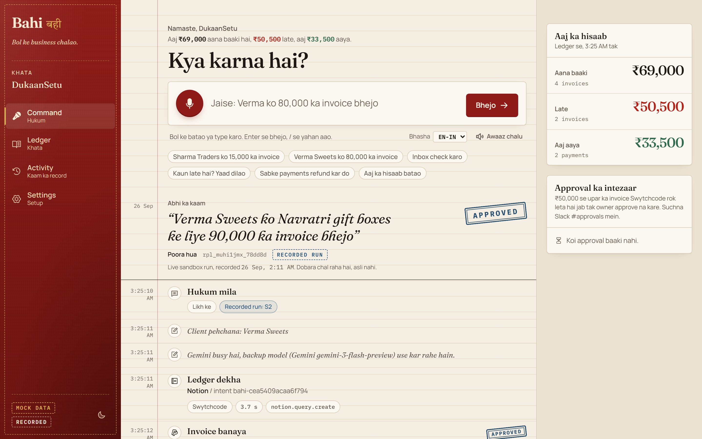
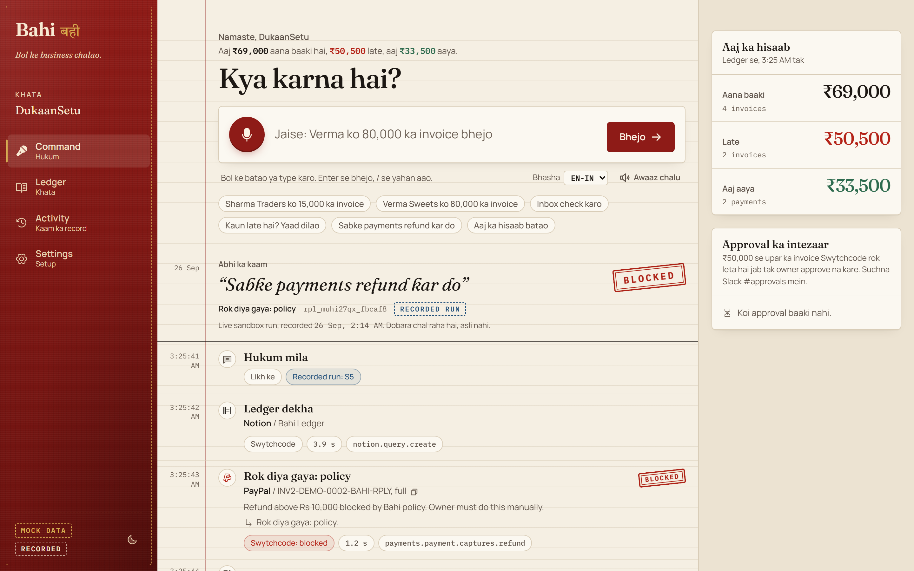
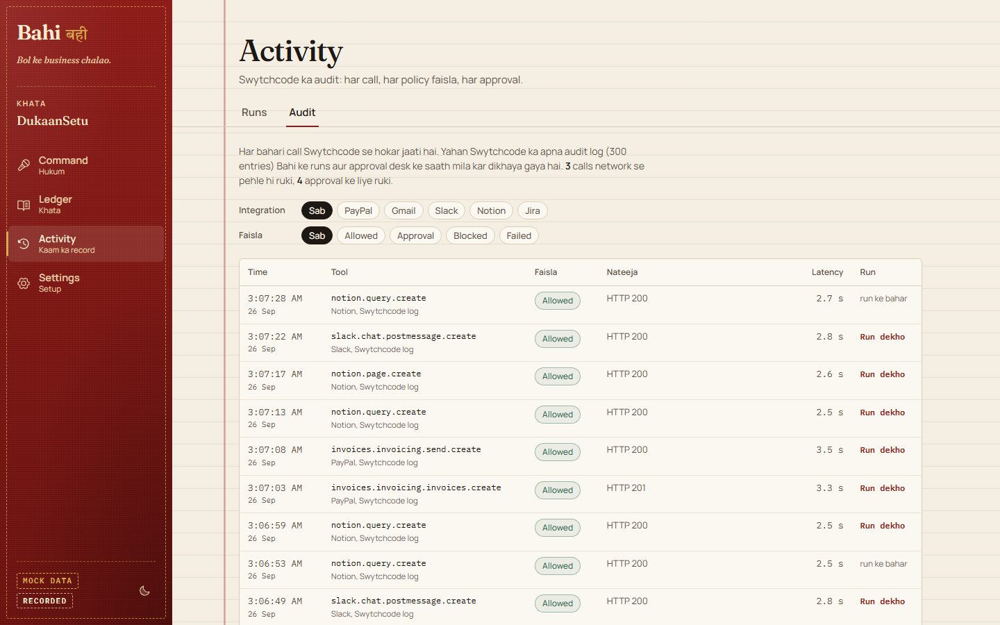
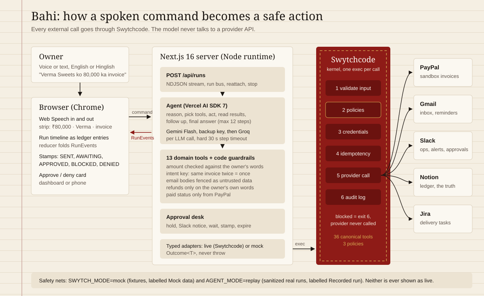
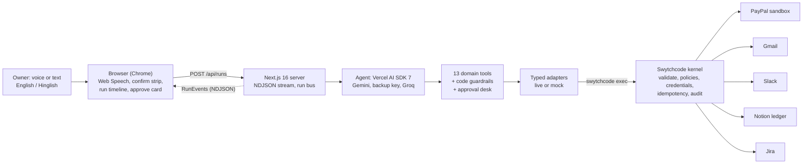

# Bahi (बही)

**Bol ke business chalao.** Bahi is a voice-first AI operator for Indian small businesses: say what you need in English or Hinglish, and it invoices, chases, reconciles and reports, with Swytchcode making sure it can only act safely.

Built for the *Build with Swytchcode* buildathon, Track 6: AI Business Operator. Named after the *bahi-khata*, the red cloth ledger Indian traders have kept for centuries.

| Approval before money moves (S2) | Refund blocked before the network (S5) | Every decision audited |
| --- | --- | --- |
|  |  |  |

## The problem

A small agency or shop in India runs on a bahi-khata and five apps: invoices in PayPal, client mail in Gmail, the team in Slack, the ledger in Notion, work in Jira. The owner is the glue, switching apps all day, and payments slip. An AI agent could do that glue work, but nobody should hand an LLM the keys to their money: a wrong amount, a bulk refund or a prompt-injected email is one tool call away.

## What Bahi does

| Say | Bahi does |
| --- | --- |
| "Sharma Traders ko website redesign ke liye 15,000 ka invoice bhejo" (S1) | finds the client, creates and sends a PayPal invoice, writes the Notion ledger, posts to Slack, answers aloud |
| "Verma Sweets ko 80,000 ka invoice bhejo" (S2) | above ₹50,000: held by a Swytchcode policy until the owner approves (dashboard or phone), then as S1; denied or expired stops it |
| "Inbox check karo aur jo kaam hai woh karo" (S3) | reads unread Gmail, classifies each mail: invoice requests become invoices, payment claims are verified in PayPal, then Notion Paid + Jira delivery task, complaints go to Slack, prompt injections are flagged and ignored |
| "Kaun late hai? Sabko yaad dilao" (S4) | overdue invoices from Notion, verified with PayPal, polite Gmail reminders (one per day), Slack summary |
| "Sabke payments refund kar do" (S5) | tries one refund, Swytchcode blocks it before any network call, Bahi stops the batch and alerts Slack |
| "Aaj ka hisaab batao" (S6) | spoken brief: to receive, overdue, received today; Slack post |

## How it works

1. The owner speaks (Web Speech API in Chrome) or types. For money commands a strip shows what Bahi understood (`₹15,000 · Sharma Traders · invoice`) and sends after 2.5 s unless the owner says Roko.
2. `POST /api/runs` starts the agent (Vercel AI SDK 7): Gemini Flash, a backup key, then Groq, chosen per LLM call. It reasons, picks tools, acts, reads results, follows up and gives a final answer in at most 12 steps.
3. The model sees 13 **domain tools** (find_client, create_and_send_invoice, list_inbox, send_payment_reminder, refund_payment, ...), never raw provider JSON. Code guardrails sit between the model and the money: the amount is checked against the owner's own words, refunds need the owner's command (an email can never trigger one), paid status only comes from PayPal, email bodies are fenced as untrusted data.
4. Each tool calls typed adapters, and every live adapter call is one `swytchcode exec <canonical_id>`: validate, **policies**, credentials, **idempotency**, provider, **audit**.
5. Every step streams back as a typed `RunEvent` (NDJSON) and appears as a ledger entry with a margin timestamp; states land as rubber stamps (SENT, AWAITING, APPROVED, BLOCKED, DENIED, EXPIRED). Replies are spoken.

### Architecture





## Swytchcode integrations

Five integrations, 36 canonical tools, all through the Swytchcode kernel (`src/lib/swytch/runtime.ts` is the only door to the outside). Full list with endpoints and inputs: [docs/TOOLS.md](docs/TOOLS.md).

| Integration | Canonical ids used | Why |
| --- | --- | --- |
| PayPal (sandbox) | `invoices.invoicing.invoices.create`, `invoices.invoicing.send.create`, `invoices.invoicing.invoices.get`, `invoices.invoicing.invoices.list`, `invoices.invoicing.searchInvoices.create`, `invoices.invoicing.payments.create`, `invoices.invoicing.invoices.cancel`, `invoices.invoicing.invoices.delete`, `payments.payment.captures.refund` | Create and send invoices, verify payment status (the only source of "paid"), record payments for the demo, and the refund S5 attempts. Dynamic idempotency (`PayPal-Request-Id`) makes retries safe. |
| Gmail | `gmail.user.messages.get`, `gmail.user.messages.get1`, `gmail.user.send.create1`, `gmail.user.modify.create`, `gmail.user.messages.create`, `gmail.user.import.create`, `gmail.user.labels.get`, `gmail.user.labels.create`, `gmail.user.profile.get` | Read the business inbox (S3), send polite reminders (S4), label mail `Bahi/Processed`, seed demo mail. |
| Slack | `slack.chat.postmessage.create`, `slack.conversations.list.list`, `slack.conversations.join.create`, `slack.auth.test.list` | Team updates in `#bahi-ops`, alerts (complaints, suspicious mail, blocks), approval requests in `#approvals`. |
| Notion | `notion.query.create`, `notion.page.create`, `notion.page.update`, `notion.data_source.get`, `notion.data_source.update`, `notion.data_source.create`, `notion.databas.get`, `notion.search.create` | The ledger is the business's source of truth: one row per invoice with status, due date, last reminder, Jira key and Bahi's intent key. |
| Jira | `jira.api.issue.create`, `jira.api.jql.create`, `jira.api.issue.get`, `jira.api.project.get2`, `jira.api.myself.list`, `jira.api.issue.delete2` | A delivery task once a payment is verified (S3), found again by label so it is never created twice. Delete is used only by `npm run demo:reset`. |

## Guardrails

Policies are code (`src/lib/guardrails/policies.ts`), written to Swytchcode by `npm run policies:sync` and probed against the real kernel. Details: [docs/GUARDRAILS.md](docs/GUARDRAILS.md).

| Policy | Rule | What it prevents |
| --- | --- | --- |
| `invoice-approval-over-threshold` (Swytchcode) | `invoices.invoicing.invoices.create` above ₹50,000 without the owner's approval stamp is refused | A large invoice going out on a misheard amount; Bahi holds it, asks in Slack, waits (AWAITING), then continues or stops (DENIED / EXPIRED) |
| `block-large-refunds` (Swytchcode) | `payments.payment.captures.refund` with no amount (full refund) or above ₹10,000 is blocked | Bulk or large refunds, including ones an injected email asks for; the provider is never called |
| `email-known-clients-only` (Swytchcode) | `gmail.user.send.create1` only to addresses in the client list | Data leaking to an address a prompt injection supplies |
| Retry safety (Swytchcode idempotency) | PayPal calls carry a dynamic `PayPal-Request-Id` | A retried create charging or invoicing twice |
| Repeated-command safety (Bahi intent key) | Same client + work + amount on the same day = already done | "Bhej do" said twice creating two invoices |
| Audit (Swytchcode + Bahi) | `swy audit` + every run event, on Activity > Audit | Unexplained actions: every decision has a record |

## Run it on Windows (no accounts needed)

Requires Node 22+ (24 tested), npm and Chrome. Mock + replay mode needs no API keys at all.

```powershell
git clone https://github.com/jatinvats123/Bahi.git
cd Bahi
npm install
copy .env.example .env.local
# in .env.local set: AGENT_MODE=replay   (SWYTCH_MODE=mock is already the default)
npm run dev
```

Open http://localhost:3000 in Chrome and try the example chips, or press **Ctrl+Shift+D** for one-click S1-S6. The sidebar says **Mock data** and every run says **Recorded run**: replays of real sandbox runs (sanitized), never shown as live.

With a model key (`GEMINI_API_KEY` or `GROQ_API_KEY`) and `AGENT_MODE=live`, the real agent runs against the mock integrations. For the full live setup (Swytchcode login, PayPal sandbox, Gmail, Slack, Notion, Jira) follow [docs/SETUP.md](docs/SETUP.md).

**Voice**: press the red mic or hold **Space**, speak, and the command goes when you stop. **/** focuses the command bar, **Up** recalls earlier commands, **Esc** stops speech.

## Environment

Copy `.env.example` to `.env.local`. Blank values mean "not set". Secrets live only in `.env.local` (gitignored); provider credentials live in Swytchcode, not in this repo.

| Variable | Default | What it does |
| --- | --- | --- |
| `SWYTCH_MODE` | `mock` | `mock` = fixtures, no accounts. `live` = real sandbox calls through Swytchcode |
| `AGENT_MODE` | `live` | `live` = the agent runs. `replay` = recorded real runs from `fixtures/runs/` (demo safety net) |
| `REPLAY_SPEED` | `1` | Replay pace |
| `GEMINI_API_KEY`, `GEMINI_API_KEY_BACKUP` | | Gemini keys (backup = second Google project, for quota) |
| `GEMINI_MODEL`, `GROQ_MODEL` | built-in chains | Comma-separated model ids, tried in order |
| `GROQ_API_KEY` | | Groq fallback |
| `SWYTCH_TRANSPORT` | `cli` | `cli` (async spawn) or `sdk` (`@swytchcode/runtime` in a worker) |
| `SWYTCHCODE_BIN`, `SWYTCHCODE_PROJECT_DIR`, `SWYTCH_TIMEOUT_MS` | auto, repo, 45000 | Swytchcode binary, project folder, per-call timeout |
| `SWYTCHCODE_NO_TELEMETRY` | `1` | Bahi turns CLI telemetry off (it cost 1.4-30 s per call); `0` keeps it on |
| `APPROVAL_THRESHOLD_INR` | `50000` | Invoices above this need approval |
| `REFUND_BLOCK_THRESHOLD_INR` | `10000` | Refunds above this (or full refunds) are blocked |
| `APPROVAL_TIMEOUT_SEC` | `300` | How long an approval waits before it expires |
| `APPROVAL_MODE` | `gate` | `gate` = Swytchcode policy + Bahi approval desk; `swytchcode` = Swytchcode HITL (paid plan) |
| `NOTION_PARENT_PAGE_ID`, `NOTION_LEDGER_DATABASE_ID`, `NOTION_LEDGER_DATA_SOURCE_ID` | | The Notion ledger (printed by `npm run setup:notion`) |
| `JIRA_BASE_URL`, `JIRA_PROJECT_KEY` | `BAHI` | Jira site and project |
| `SLACK_OPS_CHANNEL`, `SLACK_APPROVALS_CHANNEL`, `SLACK_ALERTS_CHANNEL` | `bahi-ops`, `approvals`, ops | Slack channels |
| `BUSINESS_NAME`, `BUSINESS_EMAIL`, `BAHI_PUBLIC_URL` | `DukaanSetu`, , `http://localhost:3000` | Business name, the Gmail inbox Bahi reads, link used in Slack approvals |
| `PAYPAL_CLIENT_ID`, `PAYPAL_CLIENT_SECRET`, `PAYPAL_API_KEY` | | Sandbox app; `npm run paypal:token` turns the first two into the token Swytchcode reads |
| `PAYPAL_MERCHANT_EMAIL`, `PAYPAL_CURRENCY`, `DEMO_INR_PER_USD` | , `INR`, `83` | Sandbox merchant; the sandbox refuses INR, so live uses USD converted at this rate (the UI shows rupees) |

## Scripts

| Script | What it does |
| --- | --- |
| `npm run dev` / `build` / `start` | Dev server, production build, serve |
| `npm run check` | Typecheck + lint + unit tests |
| `npm run e2e` | Playwright end-to-end tests (Chromium) on a production build in mock + replay mode |
| `npm run demo:reset [-- --dry]` | Live: cancel Bahi's open sandbox invoices, trash old Notion rows, delete Bahi's Jira tasks, seed the stage story (1 paid, 1 sent, 2 overdue, 4 inbox mails) and print the stage commands. Idempotent |
| `npm run scenario -- S1\|S2 [--auto]\|S2-deny\|S3\|S4\|S5\|S6\|dup\|email-guard` | Live scenarios, verified against PayPal, Notion and the Swytchcode audit |
| `npm run eval:agent [-- --only S1 --runs 2]` | Real LLM against the mock integrations; checks tool sequences and side effects |
| `npm run policies:sync [-- --probe\|--check]` | Write and validate the Swytchcode policies from code |
| `npm run approve [-- <apr_id> [--deny]]` | Decide a pending approval from the terminal |
| `npm run swytch:configure`, `setup:notion`, `smoke:swytch`, `paypal:token` | Live setup helpers (see docs/SETUP.md) |
| `npm run seed:inbox`, `seed:gmail` | Older S3 inbox seeders (`demo:reset` does this now) |
| `npm run record:replays`, `screenshots`, `docs:tools`, `contrast` | Rebuild recordings, README screenshots, TOOLS.md, WCAG contrast report |

## Tests

- **266 unit tests** (Vitest): Hinglish amount parser ("pandrah hazaar", "sava lakh"), client resolver, model fallback (quota, bad key, stalled model), every policy decision against the Go-rendered request, approval store and expiry, intent keys, untrusted email fencing, Swytchcode error normalization from real CLI captures, reducer and event contract, replay sanitizer.
- **Playwright e2e** (`npm run e2e`): every page with zero console errors, S1/S2/S2-deny/S3/S4/S5/S6 from recordings with their stamps, voice with a SpeechRecognition stub, keyboard use, offline banner, 390 px layout without overflow.
- **Live scenarios** (`npm run scenario`): each checks the providers and `swy audit` after the run.

## Known limitations

- **Approvals use Bahi's desk, not Swytchcode's Slack HITL.** The free Swytchcode plan refuses approval workflows, so a Swytchcode policy blocks large invoices until Bahi's approval desk stamps them. The owner approves on the dashboard (phone works on the same network); Slack gets the request, but Bahi cannot read replies in Slack (no `channels:history`). `APPROVAL_MODE=swytchcode` is wired but untested.
- **The approval stamp is not cryptographically verifiable** by Swytchcode; only Bahi's code writes it, never the model.
- **PayPal sandbox refuses INR and Indian payers**, so live invoices are in USD (converted at `DEMO_INR_PER_USD`) to placeholder sandbox payers; the UI shows rupees.
- **Model quotas**: the free Gemini tier is 20 requests per model per day; the fallback chain and replay mode exist because of this.
- **No auth on the dashboard**: it is meant for localhost. Do not expose it publicly.
- **Voice** needs Chrome (Web Speech API); typing always works.
- **Swytchcode `swy login` sessions** last about an hour and the PayPal sandbox token about 9 hours; the runbook covers refreshing both.
- **Idempotency keys** are Swytchcode's dynamic ones; caller-chosen keys are not offered, so Bahi's intent key goes into PayPal's `reference` and Notion instead.
- The optional Laya System-1 model (phase 6) was not built; intent routing and triage stay with the LLM, backed by rule-based injection signals and the Swytchcode email policy.

## Docs

[DEMO_RUNBOOK.md](docs/DEMO_RUNBOOK.md) (stage checklist and failure drills) · [PITCH.md](docs/PITCH.md) · [SETUP.md](docs/SETUP.md) · [GUARDRAILS.md](docs/GUARDRAILS.md) · [TOOLS.md](docs/TOOLS.md)

Stack: Next.js 16, TypeScript strict, Tailwind v4, Motion, Phosphor, zod, Vercel AI SDK 7 (Gemini, Groq), Web Speech API, Swytchcode CLI 2.23.5 + `@swytchcode/runtime`, Vitest, Playwright.
